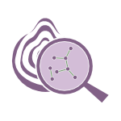
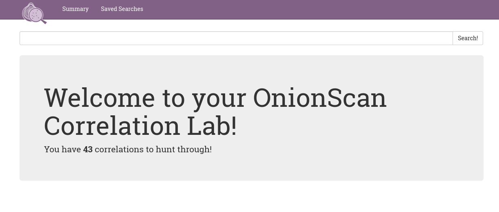

# What is OnionScan?   

OnionScan is a free and open source tool for investigating the Dark Web. For all
the amazing technological innovations in the anonymity and privacy space, there 
is always a constant threat that has no effective technological patch - human
error. 

Whether it is operational security leaks or software misconfiguration - most
often times the attacks on anonymity don't come from breaking the underlying
systems, but from ourselves.

OnionScan has two primary goals:

* We want to help **operators of hidden services find and fix operational security 
 issues with their services**. We want to help them detect misconfigurations and we
 want to inspire a new generation of anonymity engineering projects to help make
 the world a more private place.
  
* Secondly we want to help **researchers** and **investigators monitor and track  Dark Web sites**.
 In fact we want to make this as easy as possible. Not because we agree with the 
 goals and motives of every investigation force out there - most often we don't.
 But by making these kinds of investigations easy, we hope to create a powerful
 incentive for new anonymity technology (see goal #1)

## Installing

### A Note on Dependencies

OnionScan requires either Go 1.6 or 1.7.

In order to install OnionScan you will need the following dependencies not 
provided by the core go standard library:

* github.com/HouzuoGuo/tiedot/db - For crawl database.
* github.com/rwcarlsen/goexif/exif - For EXIF data extraction.
* github.com/rwcarlsen/goexif/tiff - For EXIF data extraction.
* golang.org/x/crypto/openpgp - For PGP parsing
* golang.org/x/net/html - For HTML parsing
* golang.org/x/net/proxy - For the Tor SOCKS Proxy connection.

See <a href="https://github.com/s-rah/onionscan/wiki">the wiki</a> for guidance.

### Grab with go get

`go get github.com/s-rah/onionscan`

### Compile/Run from git cloned source

Once you have cloned the repository into somewhere that go can find it you can
run `go install github.com/s-rah/onionscan` and then run the binary in `$GOPATH/bin/onionscan`.

Alternatively, you can just do `go run github.com/s-rah/onionscan.go` to run without compiling.

## Quick Start

For a simple report detailing the high, medium and low risk areas found with a
hidden service:

`onionscan notarealhiddenservice.onion`

The most interesting output comes from the verbose option:

`onionscan --verbose notarealhiddenservice.onion`

There is also a JSON output, if you want to integrate with another program or 
application:

`onionscan --jsonReport notarealhiddenservice.onion`

If you would like to use a proxy server listening on something other that 
`127.0.0.1:9050`, then you can use the --torProxyAddress flag:

`onionscan --torProxyAddress=127.0.0.1:9150 notarealhiddenservice.onion`

More detailed documentation on usage can be found in [doc](doc/README.md).

## What is scanned for?

A list of privacy and security problems which are detected by OnionScan can be
found [here](doc/what-is-scanned-for.md).

You can also directly configure the types of scanning that onionscan does using
the scans parameter.

`./bin/onionscan --scans web notarealhiddenservice.onion`

## Running the OnionScan Correlation Lab

If you are a researcher monitoring multiple sites you will definitely want to use
the OnionScan Correlation Lab - a web interface hosted by OnionScan that allows
you to discover, search and tag different identity correlations.

You can find a full guide on the OnionScan correlation lab [here](doc/correlation-lab.md).

# 

