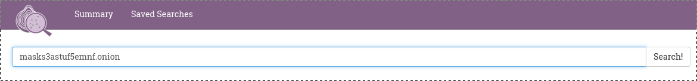
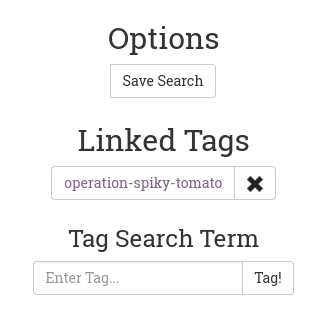
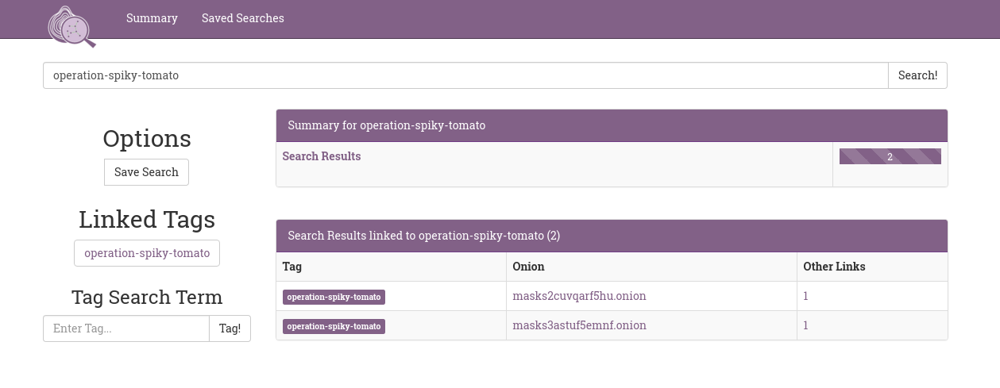

# OnionScan Correlation Lab

# Discovery Identity Correlations

The OnionScan Correlation Lab is a rather unique environment. The Lab provides
you with a way of uncovering relationships between different onion sites.

The best way to often start is to enter the name of an onion service you are
interested in, in the search bar:

If you have scanned the site with OnionScan then the search should result in a
page displaying all kinds of correlations that OnionScan has detected:

You can look around this page and find identifiers and other information that
may indicate potential deanonymization vectors.

OnionScan also attempts to highlight the most important information at the top
of the page - for example, in the screen above OnionScan has added the page title
along with two tags indicating that OnionScan found a mod_status leak on the 
service in question.

# Tagging Correlations

To help with investigations, The Correlation Lab supports the tagging of search
results - you can tag any given search results, including the results for other
tags, in the left-hand column. 

You can then search for all tagged pages using the search feature - or by clicking
on the tag:

